# ZH-Learn Architecture Documentation

## Overview

ZH-Learn is a comprehensive Chinese language learning tool built with a modular, extensible architecture. The system provides AI-powered linguistic analysis, pronunciation services, and vocabulary management through a clean CLI interface. The architecture emphasizes modularity, clean boundaries, and extensibility while maintaining high performance and reliability.

## System Architecture

### High-Level System Overview

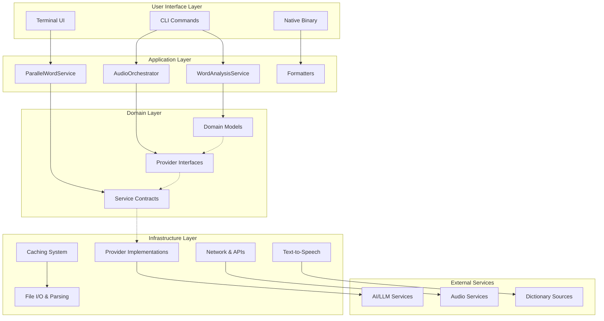

## Core Components and Flows

### Primary Use Cases

The system supports three main workflows:

1. **[Single Word Analysis](WORD_COMMAND_FLOW.md)** - Comprehensive analysis of individual Chinese words
2. **[Batch Processing](PARSE_PLECO_FLOW.md)** - Large-scale vocabulary processing with parallel execution
3. **[Audio Lookup](AUDIO_COMMAND_FLOW.md)** - Direct pronunciation retrieval and management

### Architectural Layers

#### 1. [Module System (JPMS)](MODULE_ARCHITECTURE.md)

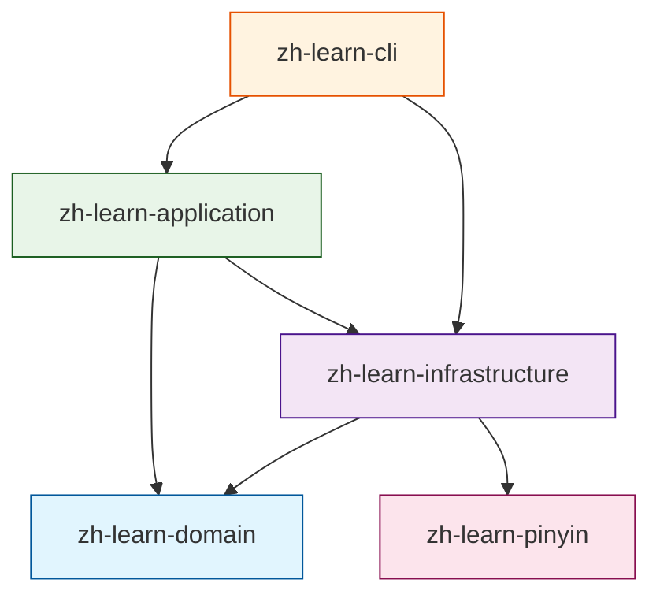

**Module Responsibilities:**
- **Domain**: Pure business logic, immutable models, interfaces
- **Infrastructure**: External integrations, provider implementations
- **Application**: Service orchestration, business workflows
- **CLI**: User interface, command processing
- **Pinyin**: Specialized utilities for pinyin processing

#### 2. [Provider System](PROVIDER_ARCHITECTURE.md)

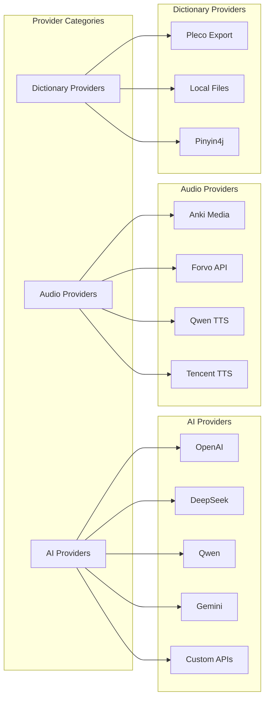

## Data Flow Architecture

### Information Processing Pipeline

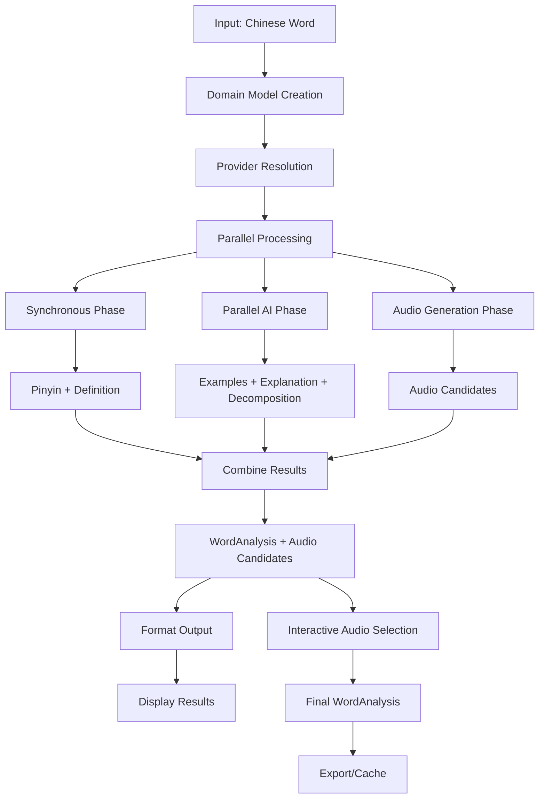

### Parallel Processing Strategy

```mermaid
gantt
    title Processing Timeline (New Architecture)
    dateFormat X
    axisFormat %s

    section Foundation
    Pinyin + Definition    :0, 1

    section Parallel Phase
    AI: Examples          :1, 4
    AI: Explanation       :1, 4
    AI: Decomposition     :1, 4
    Audio: Generation     :1, 4

    section Interactive
    Audio Selection       :4, 5
    Final Assembly        :5, 6
```

**Performance Benefits:**
- 40-50% reduction in total processing time
- Better resource utilization
- Improved user experience with immediate feedback
- Resilient to individual provider failures

## Key Architectural Patterns

### 1. Clean Architecture Principles

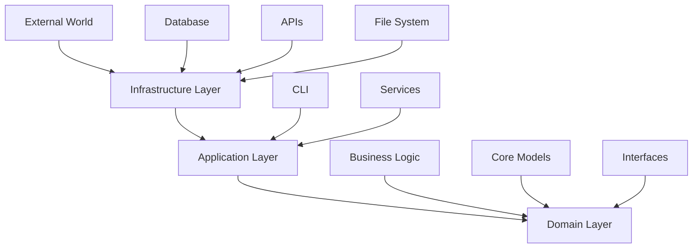

**Dependencies Flow Inward:**
- Domain has no dependencies
- Infrastructure depends on domain
- Application orchestrates infrastructure via domain interfaces
- CLI coordinates application services

### 2. Provider Pattern

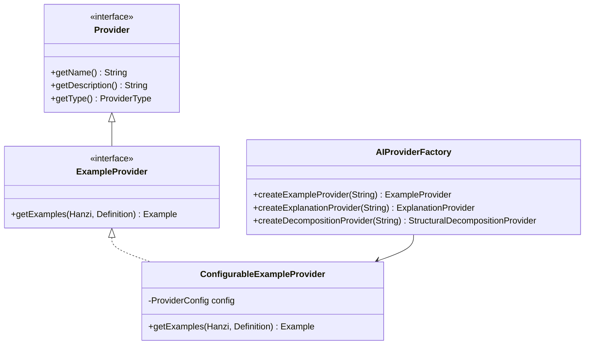

**Benefits:**
- Easy addition of new AI services
- Consistent error handling and retry logic
- Configurable behavior via environment variables
- Test-friendly with dummy implementations

### 3. Service Provider Interface (SPI)

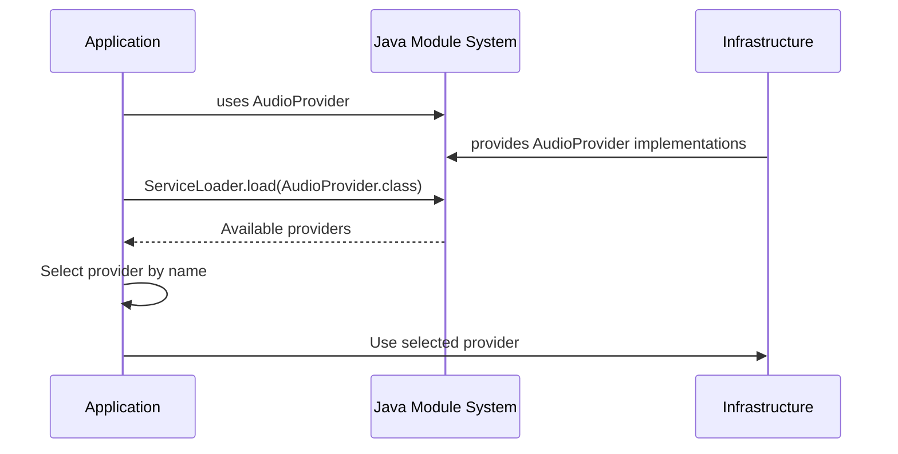

**Advantages:**
- Runtime provider discovery
- Loose coupling between layers
- Plugin architecture for extensibility
- Clean separation of concerns

## Command Architecture

### CLI Command Structure

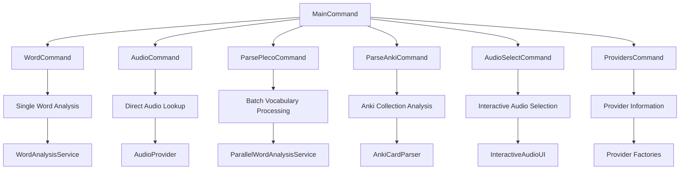

### Command Flow Patterns

Each command follows a consistent pattern:

1. **Argument Parsing** - Picocli handles CLI option processing
2. **Provider Resolution** - Factory methods create configured providers
3. **Service Orchestration** - Application services coordinate business logic
4. **Output Formatting** - Results formatted for terminal display
5. **Resource Cleanup** - Proper shutdown of executors and connections

## Concurrency and Performance

### Parallel Processing Architecture

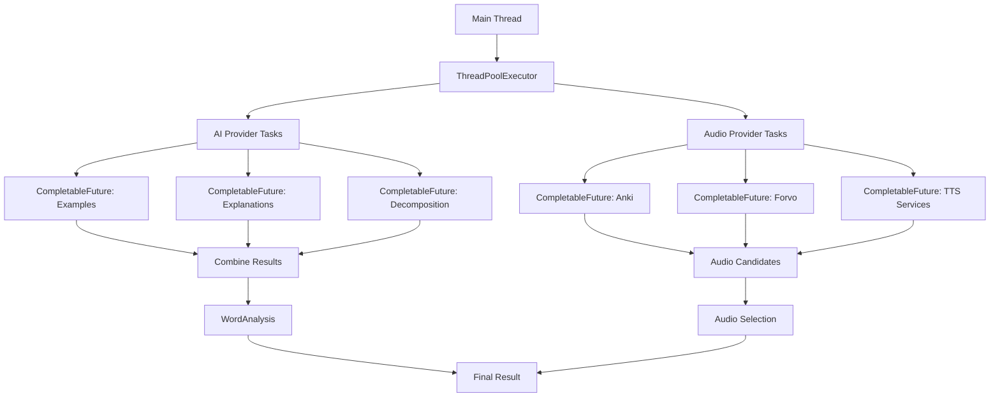

### Caching Strategy

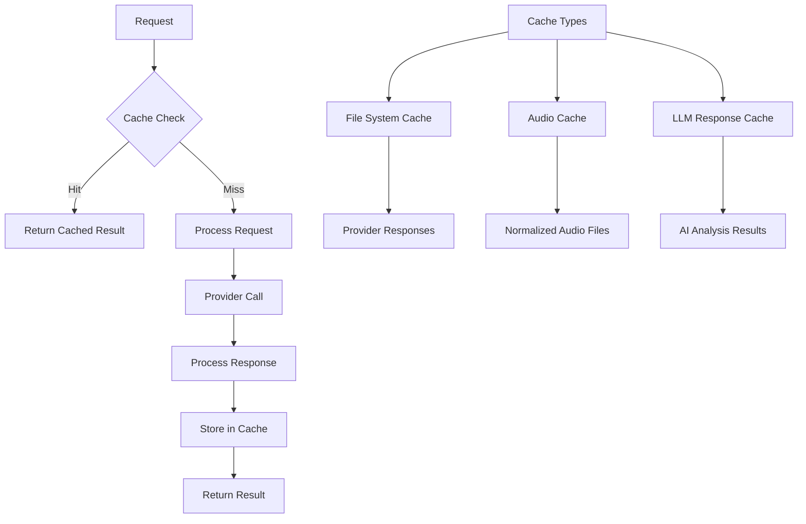

**Cache Benefits:**
- Reduced API calls and costs
- Faster subsequent lookups
- Offline availability
- Consistent audio quality via normalization

## Error Handling and Resilience

The project adheres to the fail-fast principle. Providers validate configuration and execute external calls once, surfacing failures immediately with contextual logging. The single exception is Qwen TTS HTTP 429 handling: Helidon Fault Tolerance performs an exponential backoff (5 attempts, 5s base delay, ×3 factor, 15 minute cap). If the service still returns 429 after the final attempt, the provider raises an `IOException` to terminate the command.

## Security and Configuration

### Configuration Management

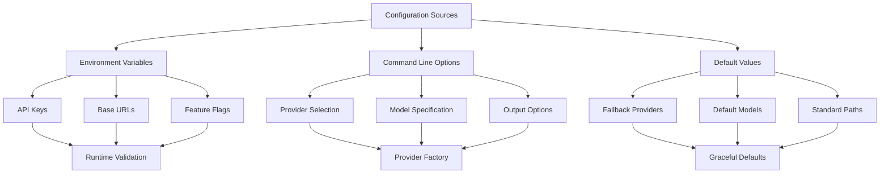

### Security Considerations

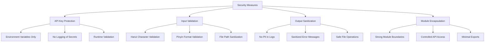

## Testing Architecture

### Testing Strategy by Layer

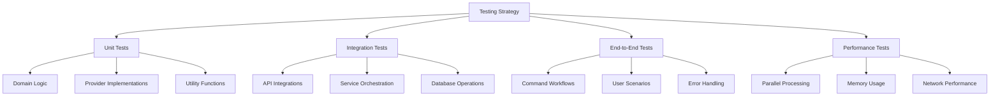

### Test Module Organization

```text
src/test/java/
├── unit/           # Fast, isolated tests
├── integration/    # API and service tests
├── e2e/           # Full workflow tests
└── performance/   # Load and stress tests

src/test/resources/
├── fixtures/      # Test data files
├── features/      # Cucumber scenarios
└── config/        # Test configurations
```

## Deployment and Build

### Build Architecture

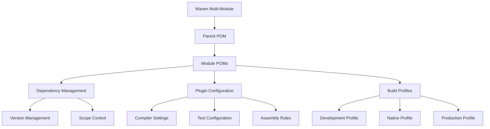

### Deployment Options

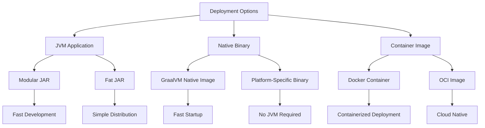

## Performance Characteristics

### System Performance Metrics

```mermaid
gantt
    title Performance Comparison: Sequential vs Parallel
    dateFormat X
    axisFormat %s

    section Sequential Processing
    Word 1 (AI + Audio)     :0, 6
    Word 2 (AI + Audio)     :6, 12
    Word 3 (AI + Audio)     :12, 18
    Audio Selection         :18, 20

    section Parallel Processing (Old)
    Words 1-3 (AI only)     :0, 4
    Audio Generation        :4, 12
    Audio Selection         :12, 14

    section Parallel Processing (New)
    Words 1-3 (AI + Audio) :0, 6
    Audio Selection        :6, 8
```

**Performance Improvements:**
- **40-50% faster** overall processing for batch operations
- **Immediate feedback** during parallel processing
- **Better resource utilization** with concurrent API calls
- **Reduced waiting time** with pre-generated audio candidates

### Memory Usage Patterns

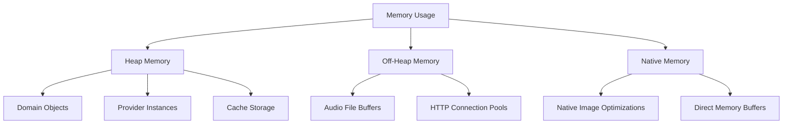

## Future Architecture Considerations

### Extensibility Points

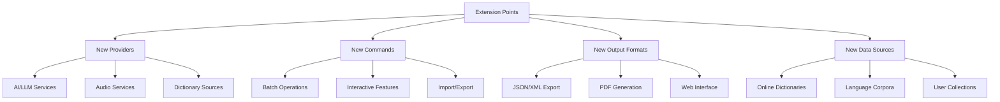

### Scalability Considerations

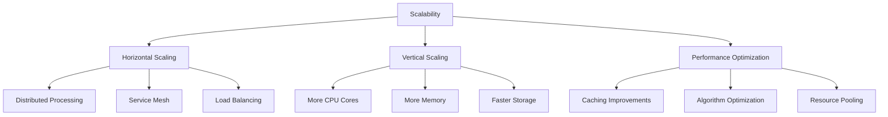

## Documentation Structure

This architecture documentation is organized into focused documents:

- **[ARCHITECTURE.md](ARCHITECTURE.md)** (this document) - High-level system overview
- **[MODULE_ARCHITECTURE.md](MODULE_ARCHITECTURE.md)** - JPMS module structure and boundaries
- **[PROVIDER_ARCHITECTURE.md](PROVIDER_ARCHITECTURE.md)** - Provider system design and patterns
- **[WORD_COMMAND_FLOW.md](WORD_COMMAND_FLOW.md)** - Single word analysis workflow
- **[AUDIO_COMMAND_FLOW.md](AUDIO_COMMAND_FLOW.md)** - Audio lookup and management
- **[PARSE_PLECO_FLOW.md](PARSE_PLECO_FLOW.md)** - Batch processing with parallel optimization

Each document provides detailed diagrams, implementation patterns, and specific technical guidance for that architectural aspect.

## Conclusion

The ZH-Learn architecture successfully balances modularity, performance, and extensibility through:

- **Clean modular boundaries** enforced by JPMS
- **Flexible provider system** enabling easy integration of new services
- **Parallel processing optimization** for improved performance
- **Robust error handling** with retry mechanisms and graceful degradation
- **Comprehensive caching** for efficiency and offline capability
- **User-centric design** with interactive features and clear feedback

This architecture supports the current feature set while providing clear extension points for future growth and enhancement.
