# Audio Command Flow Documentation

## Overview

The `audio` command provides direct pronunciation lookup for Chinese words by pinyin from existing pronunciation collections or AI-powered text-to-speech services. It's optimized for quick audio file retrieval without the overhead of full linguistic analysis.

## Command Structure

```
./zh-learn.sh audio <chinese-word> <pinyin> [options]
```

### Parameters
- `chinese-word`: Chinese characters (used for context and filename generation)
- `pinyin`: Exact pinyin with tone marks to match against pronunciation data

### Key Options
- `--audio-provider`: Audio provider to use (default: anki)
  - `anki`: Local Anki collection media files
  - `forvo`: Community pronunciation database
  - `qwen-tts`: AI-generated Chinese speech
  - `tencent`: Professional TTS service

## Processing Flow

### High-Level Audio Command Flow

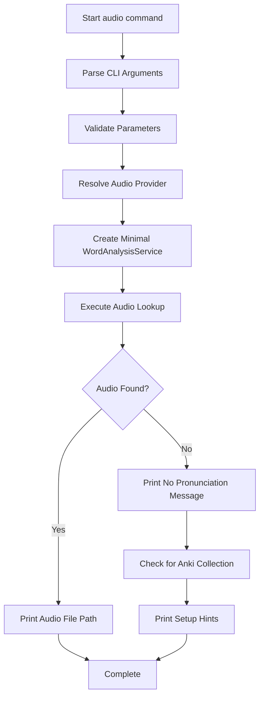

## Audio Provider Resolution

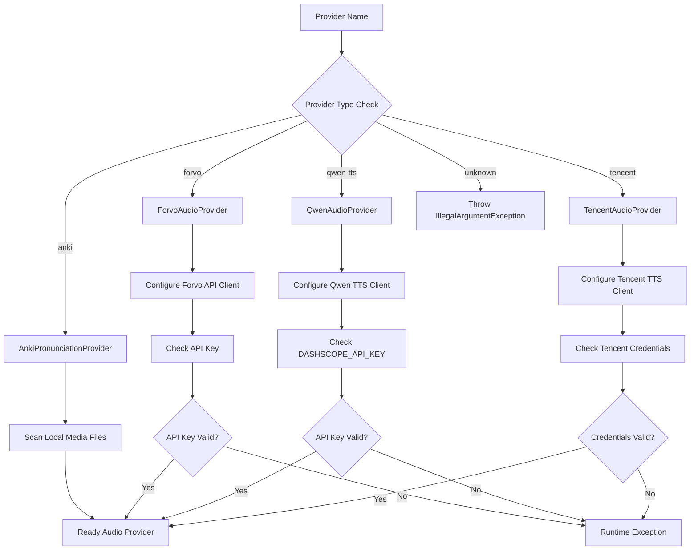

## Audio Lookup Pipeline

### Provider-Specific Lookup Flows

#### Anki Provider Flow

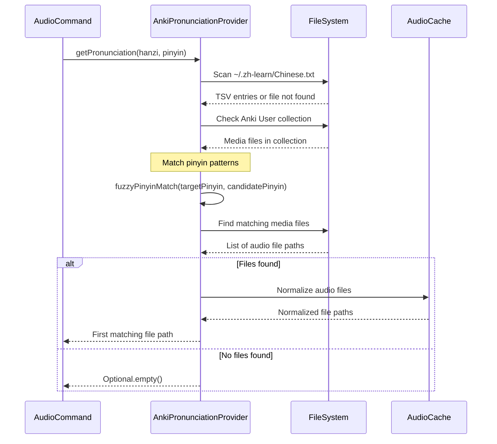

#### TTS Provider Flow (Qwen/Tencent)

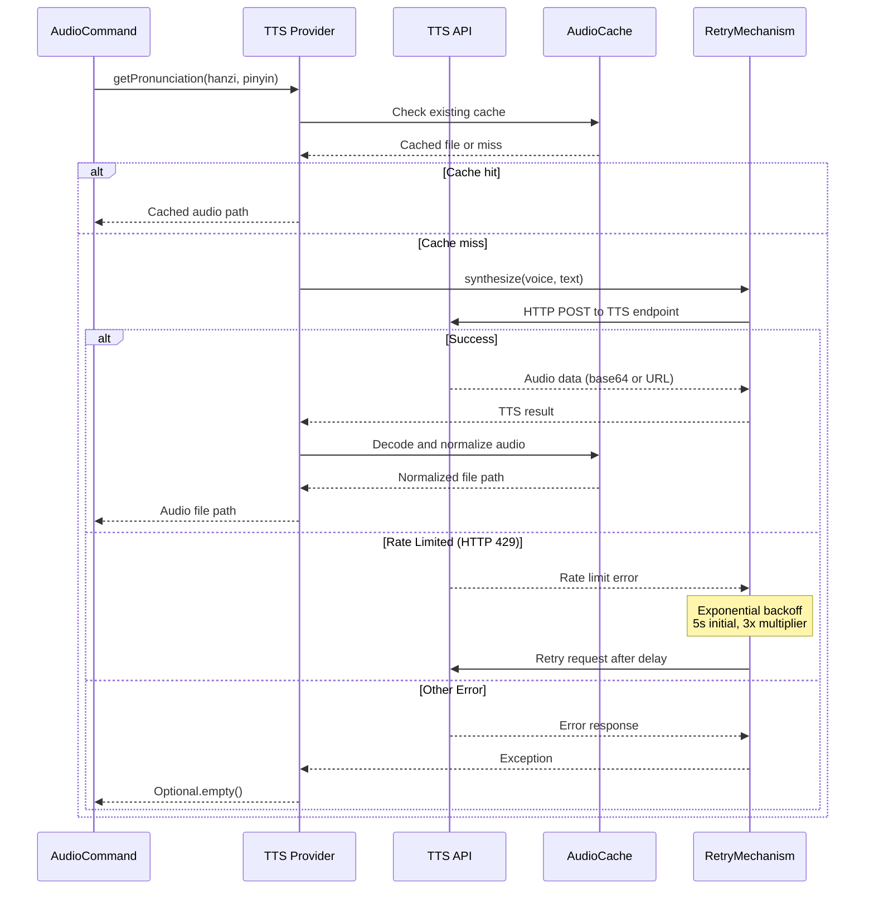

#### Forvo Provider Flow

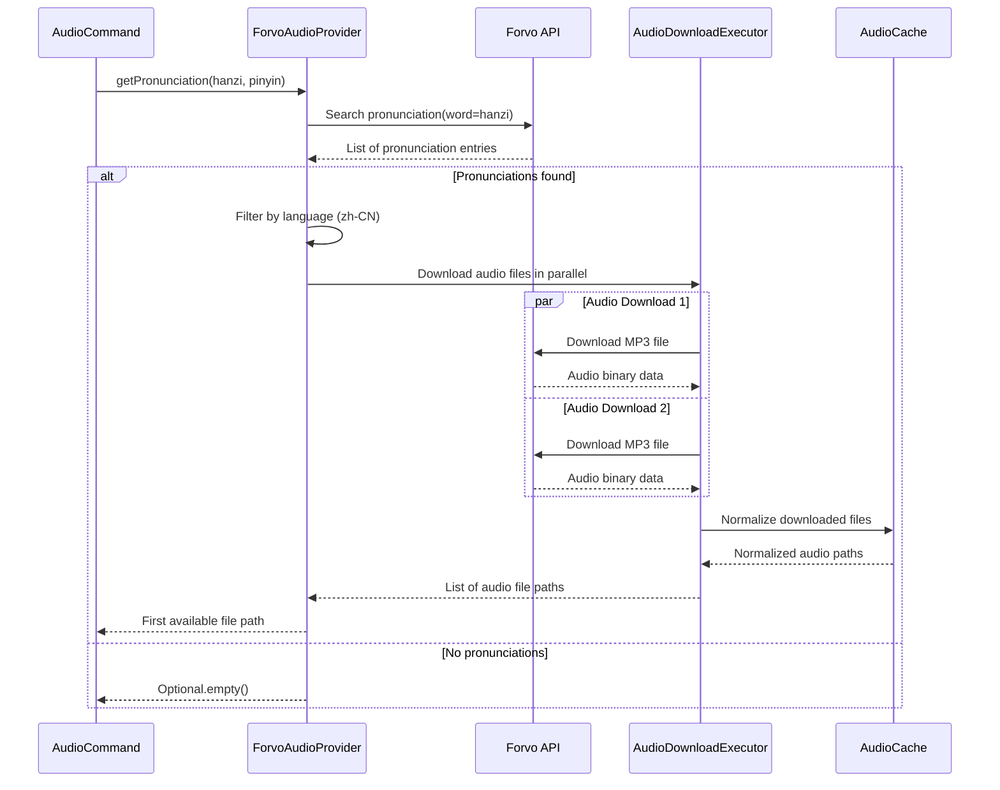

## Audio Caching and Normalization

### Audio Processing Pipeline

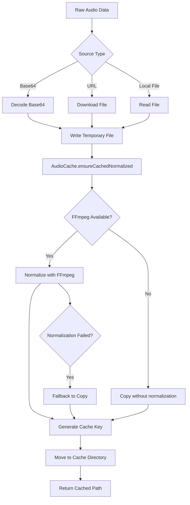

### Cache Key Generation

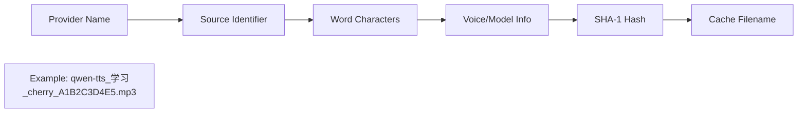

**Cache Benefits:**
- Avoids repeated API calls for same pronunciations
- Consistent audio normalization across providers
- Faster subsequent lookups
- Reduces bandwidth and API quota usage

## Error Handling and Fallbacks

### Error Response Strategy

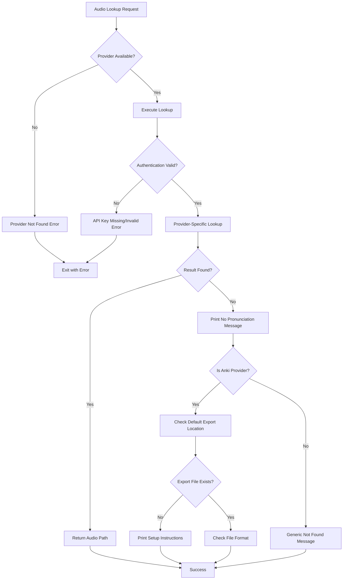

### Anki Setup Guidance

When audio lookup fails with the Anki provider, the command provides helpful guidance:

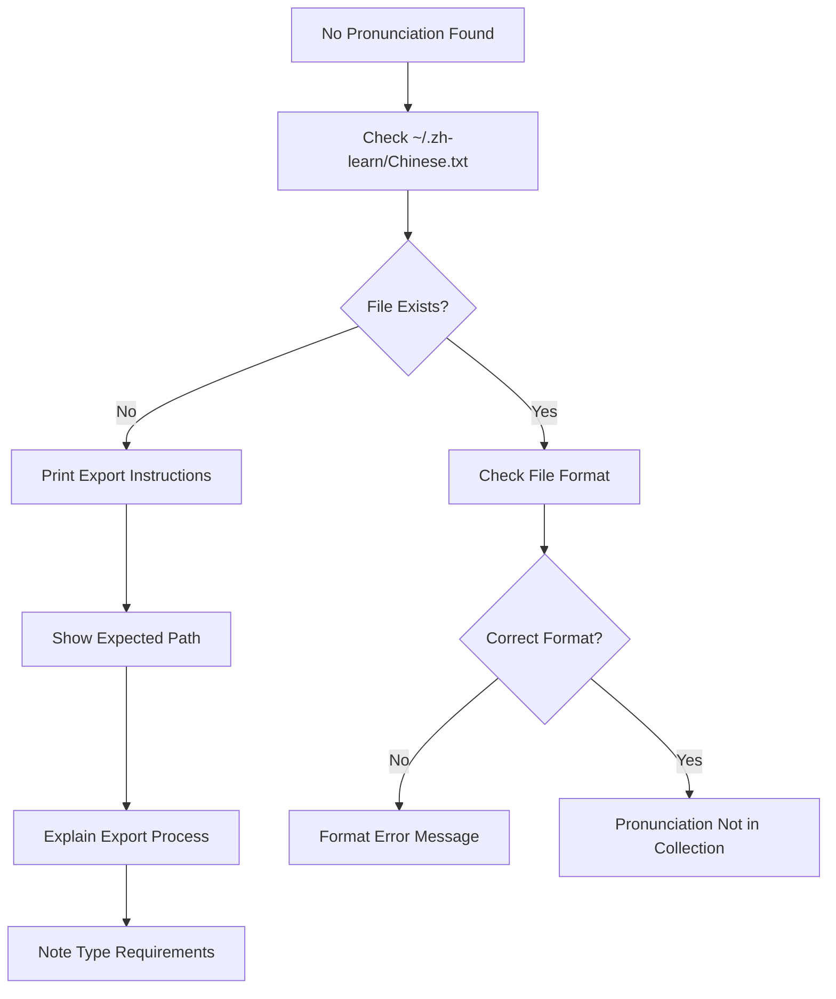

**Setup Instructions Provided:**
- Export Anki collection as TSV named 'Chinese.txt'
- Place in `~/.zh-learn/` directory
- Use 'Chinese 2' note type format
- Column mapping: 1=simplified, 2=pinyin, 3=pronunciation

## Audio Provider Comparison

### Feature Matrix

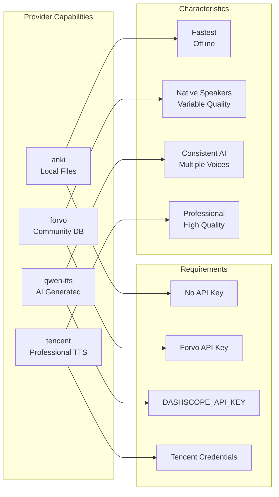

### Performance Characteristics

```mermaid
gantt
    title Audio Lookup Performance Comparison
    dateFormat X
    axisFormat %s

    section Anki (Local)
    File System Scan    :0, 1
    Audio Normalization :1, 2

    section Forvo (API)
    API Request         :0, 2
    Download Audio      :2, 4
    Audio Normalization :4, 5

    section Qwen TTS (Synthesis)
    TTS API Request     :0, 3
    Audio Generation    :3, 6
    Download + Cache    :6, 8

    section Tencent TTS (Synthesis)
    TTS API Request     :0, 3
    Audio Generation    :3, 5
    Download + Cache    :5, 7
```

## Data Flow and Output

### Command Output Formats

```mermaid
flowchart TD
    A[Audio Lookup Result] --> B{Audio Found?}
    B -->|Yes| C[Print Absolute File Path]
    B -->|No| D[Print '(no pronunciation)']

    C --> E[/Users/.../audio/file.mp3]
    D --> F[Check for Setup Issues]
    F --> G[Print Helpful Hints]

    E --> H[Command Success]
    G --> H
```

### Integration with Other Commands

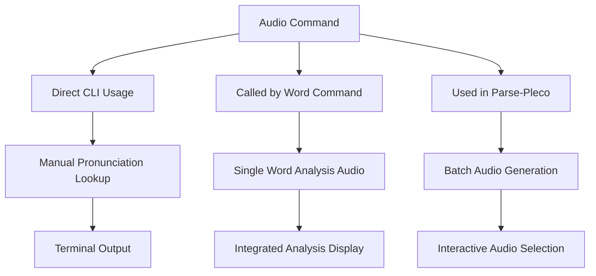

## Configuration and Environment

### Required Environment Variables

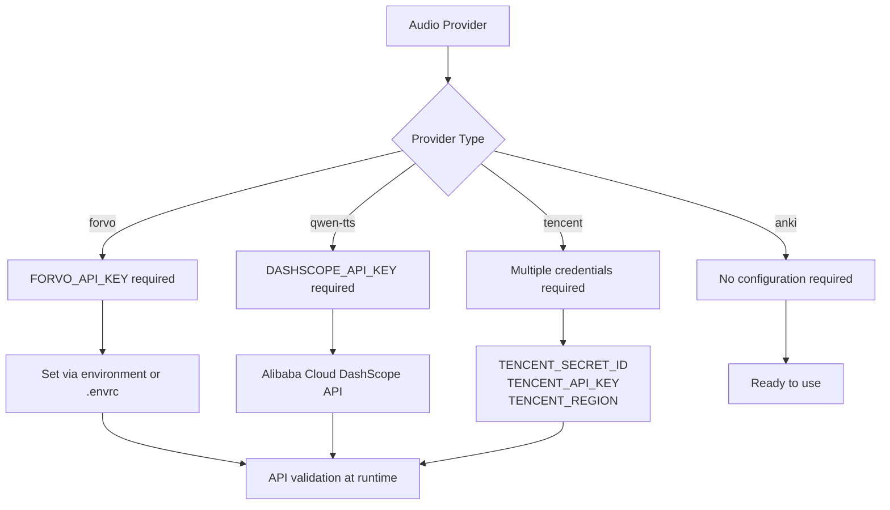

### File System Layout

```
~/.zh-learn/
├── Chinese.txt              # Anki export file
└── audio/                   # Cached audio files
    ├── anki/                # Anki audio files (normalized)
    ├── forvo/               # Forvo downloads
    ├── qwen-tts/            # Qwen TTS generated
    └── tencent-tts/         # Tencent TTS generated
```

## Usage Examples

### Basic Lookup
```bash
# Look up pronunciation in local Anki collection
./zh-learn.sh audio 学习 xuéxí

# Use specific provider
./zh-learn.sh audio 学习 xuéxí --audio-provider forvo
```

### TTS Generation
```bash
# Generate pronunciation with AI TTS
./zh-learn.sh audio 你好 nǐhǎo --audio-provider qwen-tts

# Professional TTS service
./zh-learn.sh audio 你好 nǐhǎo --audio-provider tencent
```

### Integration Patterns
```bash
# Find audio file for use in other applications
AUDIO_FILE=$(./zh-learn.sh audio 学习 xuéxí)
if [ "$AUDIO_FILE" != "(no pronunciation)" ]; then
    echo "Found audio: $AUDIO_FILE"
    # Use with audio player, Anki import, etc.
fi
```

This comprehensive flow demonstrates how the audio command provides fast, reliable pronunciation lookup through multiple sources, with intelligent caching and fallback strategies for robust audio file management.