# Module Architecture Documentation

## Overview

The zh-learn project implements a modular architecture using the Java Platform Module System (JPMS) to enforce clean boundaries, explicit dependencies, and maintainable code organization. The system is divided into five distinct modules, each with specific responsibilities and well-defined interfaces.

## Module Hierarchy

### High-Level Module Structure

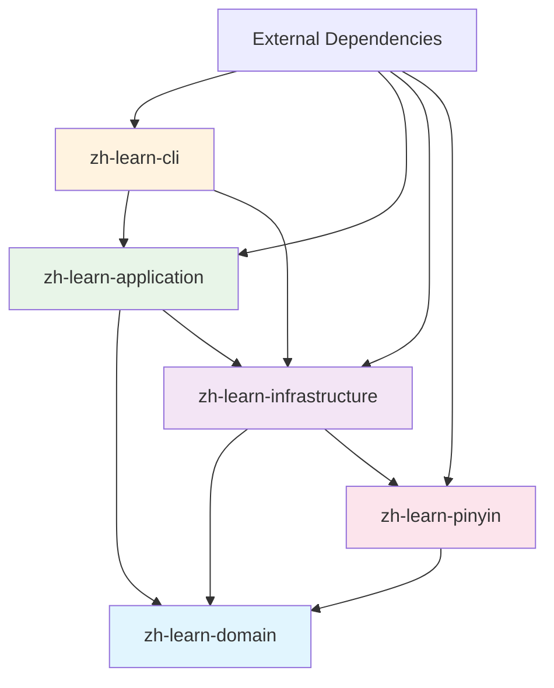

**Dependency Flow Rules:**
- **Domain**: No dependencies on other modules (pure business logic)
- **Infrastructure**: Depends on domain (implements interfaces)
- **Application**: Depends on domain and infrastructure (orchestration)
- **CLI**: Depends on application and infrastructure (user interface)
- **Pinyin**: Utility module, depends only on domain

## Module-by-Module Analysis

### zh-learn-domain (Core)

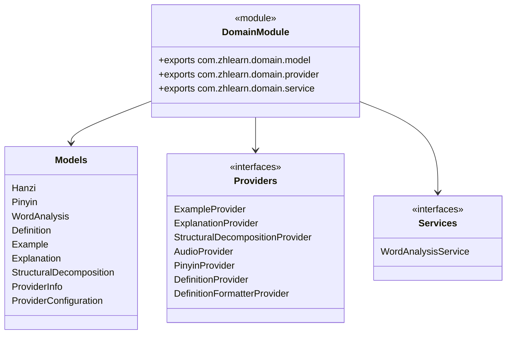

**Responsibilities:**
- Define core business entities as immutable records
- Establish provider interfaces for external services
- Declare service contracts for business operations
- Maintain zero external dependencies (pure domain logic)

**Key Design Principles:**
- Immutable data structures (`record` types)
- Interface-driven design for extensibility
- No infrastructure concerns
- Rich domain models with behavior

### zh-learn-infrastructure (Implementations)

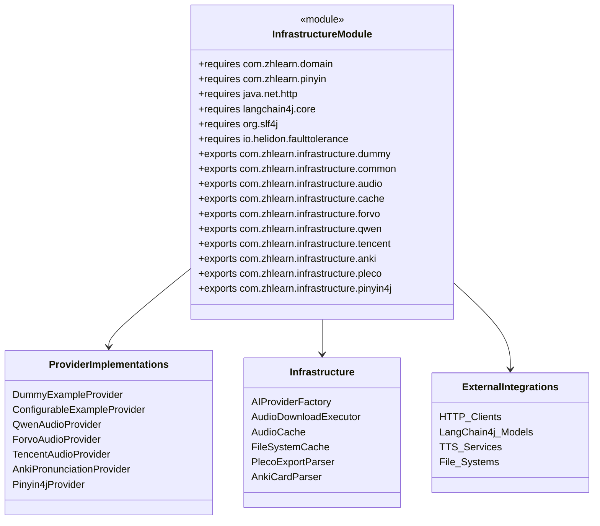

**Responsibilities:**
- Implement all domain provider interfaces
- Manage external API integrations (OpenAI, Qwen, Forvo, etc.)
- Handle caching, file I/O, and data persistence
- Provide configuration and factory classes
- Manage HTTP clients and network communications

**External Dependencies:**
- **LangChain4j**: AI model abstractions
- **Jackson**: JSON/YAML processing
- **Helidon**: Fault tolerance and retry
- **Apache Commons**: CSV parsing
- **Provider SDKs**: Tencent Cloud, etc.

### zh-learn-application (Services)

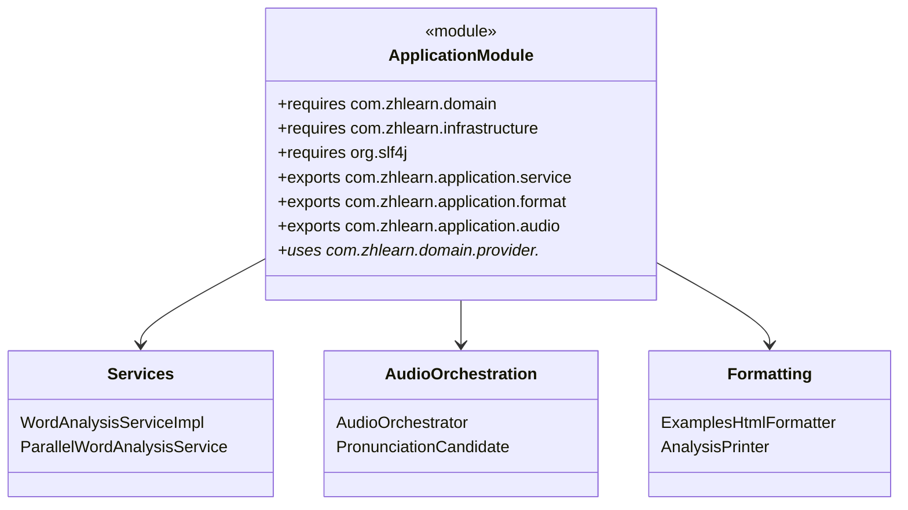

**Responsibilities:**
- Implement domain service interfaces
- Orchestrate provider calls and business workflows
- Manage parallel processing and concurrency
- Format output for different consumers
- Handle audio candidate generation and selection

**Service Provider Pattern:**
- Uses `uses` directive for dynamic provider discovery
- Enables runtime provider selection and configuration
- Supports dependency injection patterns

### zh-learn-cli (User Interface)

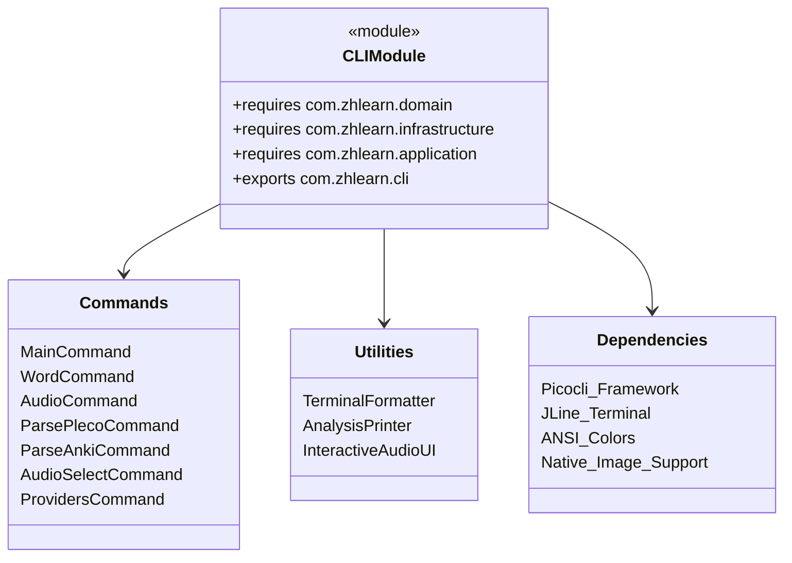

**Responsibilities:**
- Define CLI commands and option parsing
- Handle user interaction and terminal I/O
- Format output for console display
- Manage application lifecycle and resource cleanup
- Provide interactive features (audio selection, progress display)

**CLI Framework Integration:**
- **Picocli**: Command-line parsing and help generation
- **JLine**: Advanced terminal capabilities
- **ANSI Colors**: Rich console formatting
- **Native Image**: GraalVM compilation support

### zh-learn-pinyin (Utilities)

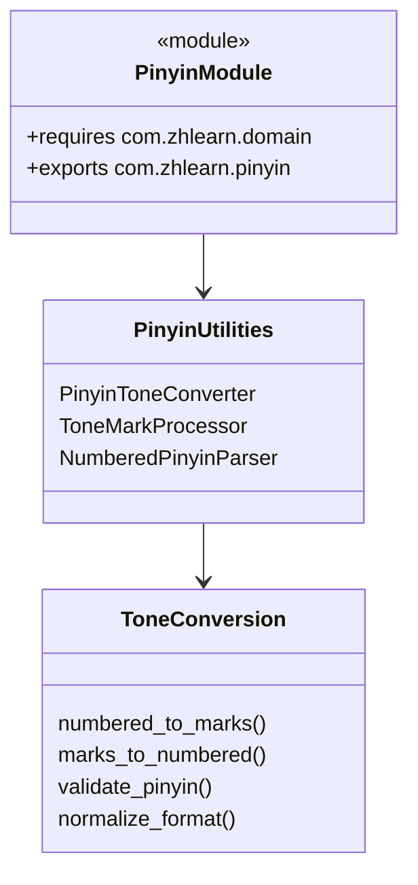

**Responsibilities:**
- Convert between pinyin formats (numbered ↔ tone marks)
- Validate pinyin syntax and structure
- Normalize pinyin representations
- Provide utilities for pinyin processing across the system

**Standalone Design:**
- Self-contained utility module
- Minimal dependencies (only domain for types)
- Reusable across different contexts
- Could be extracted as separate library

## Module Boundary Enforcement

### Dependency Validation

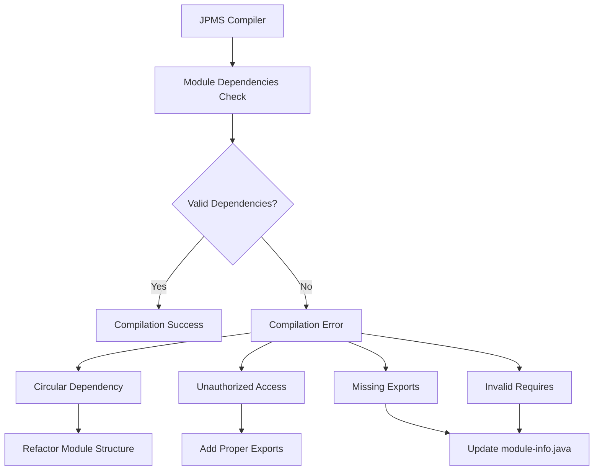

### Export Control Strategy

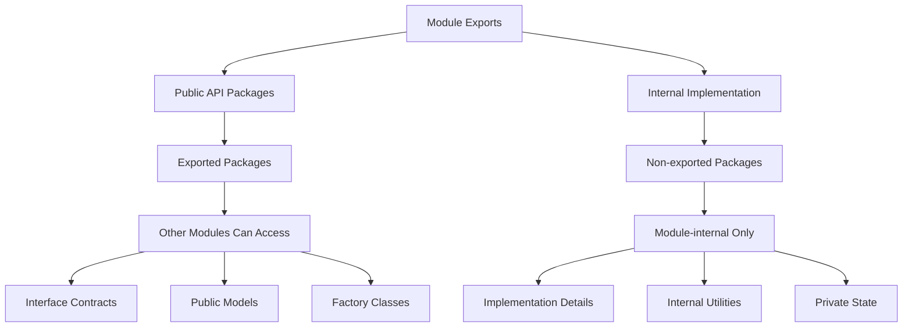

**Export Principles:**
- **Minimal Exports**: Only export what's necessary for consumers
- **Interface Focus**: Export interfaces, not implementations when possible
- **Stable Contracts**: Exported APIs should be stable and well-documented
- **Implementation Hiding**: Keep internal details unexported

## Module Communication Patterns

### Service Provider Interface (SPI)

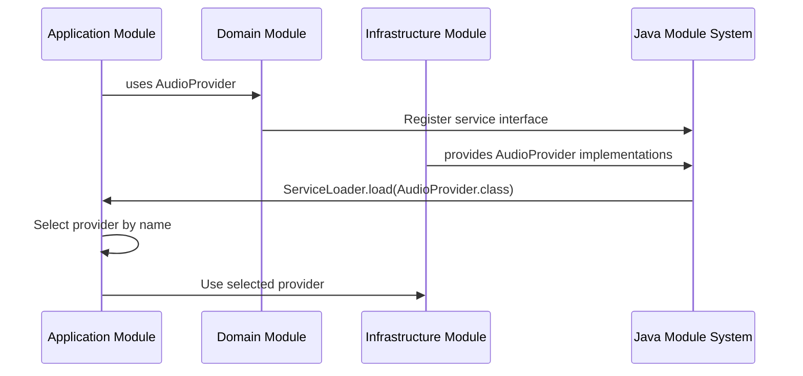

### Factory Pattern Integration

```mermaid
flowchart TD
    A[CLI Module] --> B[MainCommand Factory Methods]
    B --> C[Infrastructure Factories]
    C --> D[Provider Implementations]

    B --> E[createExampleProvider()]
    B --> F[createAudioProvider()]
    B --> G[createPinyinProvider()]

    E --> H[AIProviderFactory]
    F --> I[Direct Provider List]
    G --> J[Switch Statement]

    H --> K[ConfigurableProvider]
    I --> L[Provider Instance]
    J --> L

    K --> M[Domain Interface]
    L --> M
```

**Benefits:**
- Loose coupling between modules
- Runtime provider selection
- Easy testing with mock implementations
- Clear separation of creation and usage

## Build System Integration

### Maven Module Configuration

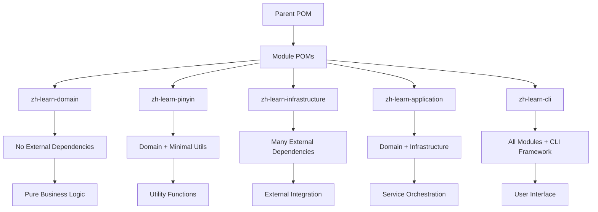

### Compilation Order and Dependencies

```mermaid
gantt
    title Module Compilation Order
    dateFormat X
    axisFormat %d

    section Compilation
    Domain         :1, 2
    Pinyin         :2, 3
    Infrastructure :3, 4
    Application    :4, 5
    CLI           :5, 6
```

**Build Characteristics:**
- **Parallel Builds**: Independent modules can compile concurrently
- **Incremental Builds**: Only changed modules need recompilation
- **Dependency Management**: Maven enforces module dependency order
- **Artifact Generation**: Each module produces its own JAR

## Testing Strategy per Module

### Module-Specific Testing Approaches

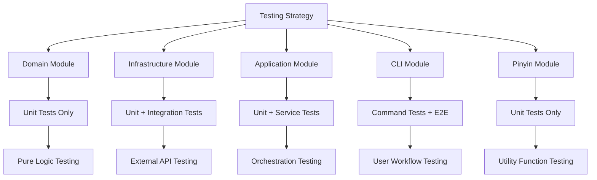

### Test Module Organization

```java
// Test module-info.java example
module com.zhlearn.infrastructure.test {
    requires com.zhlearn.infrastructure;
    requires com.zhlearn.domain;
    requires org.junit.jupiter.api;
    requires org.mockito.core;
    requires org.assertj.core;

    // Test-specific exports for test utilities
    exports com.zhlearn.infrastructure.test.utils;
}
```

## Performance Implications

### Module Loading Characteristics

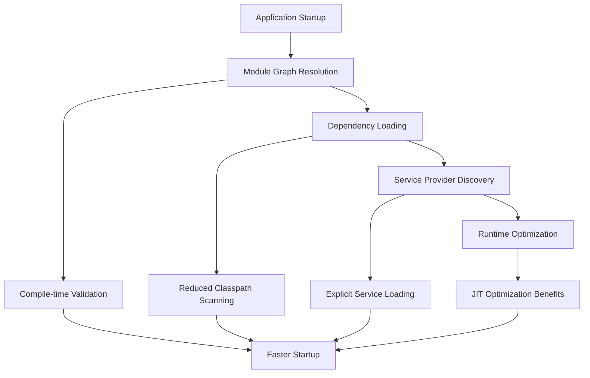

**JPMS Performance Benefits:**
- **Reduced Startup Time**: Explicit dependencies eliminate classpath scanning
- **Memory Efficiency**: Only required modules are loaded
- **Better JIT Optimization**: Module boundaries enable better code optimization
- **Reliable Resolution**: Compile-time dependency validation prevents runtime errors

### Native Image Compilation

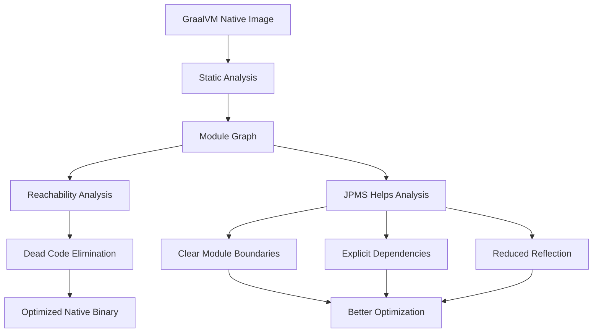

## Migration and Evolution Strategy

### Module Boundary Evolution

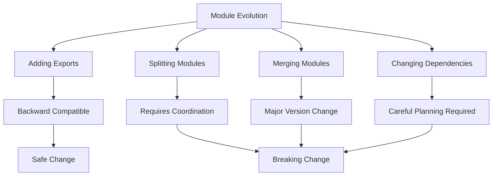

### Versioning Strategy

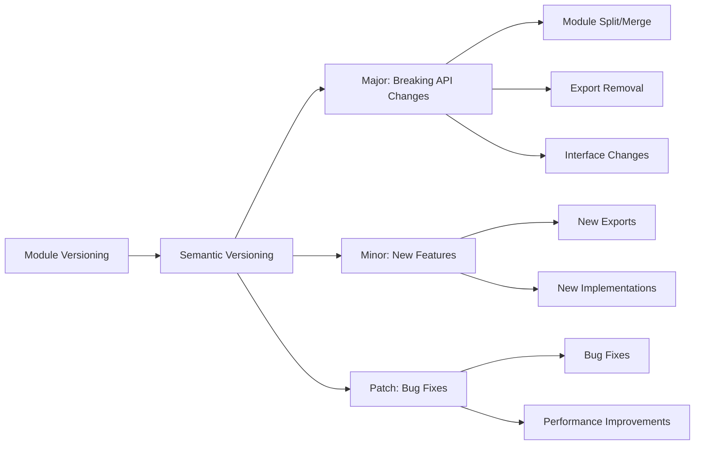

## Security and Encapsulation

### Module Security Benefits

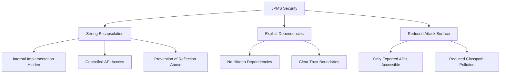

### Access Control Matrix

| Module | Domain | Infrastructure | Application | CLI | Pinyin |
|--------|--------|---------------|-------------|-----|--------|
| **Domain** | ✓ | ✗ | ✗ | ✗ | ✗ |
| **Infrastructure** | ✓ | ✓ | ✗ | ✗ | ✓ |
| **Application** | ✓ | ✓ | ✓ | ✗ | ✓ |
| **CLI** | ✓ | ✓ | ✓ | ✓ | ✓ |
| **Pinyin** | ✓ | ✗ | ✗ | ✗ | ✓ |

**Legend:**
- ✓ = Can depend on/access
- ✗ = Cannot depend on/access

This modular architecture provides strong boundaries, clear responsibilities, and maintainable code organization while leveraging the full power of the Java Platform Module System for security, performance, and reliability.