# Parse-Pleco Command Flow Documentation

## Overview

The `parse-pleco` command processes Pleco export files (TSV format) and analyzes each Chinese word through the complete zh-learn analysis pipeline. It supports both sequential and parallel processing modes, with configurable providers for different analysis components.

## Command Structure

```
./zh-learn.sh parse-pleco <file> [options]
```

### Key Options
- `--parallel-threads`: Number of threads for parallel processing (default: 10)
- `--disable-parallelism`: Force sequential processing
- `--limit`: Limit number of words to process
- `--export-anki`: Export results to Anki-compatible TSV file
- Various provider options for customizing analysis components

## Processing Flow

### High-Level Flow

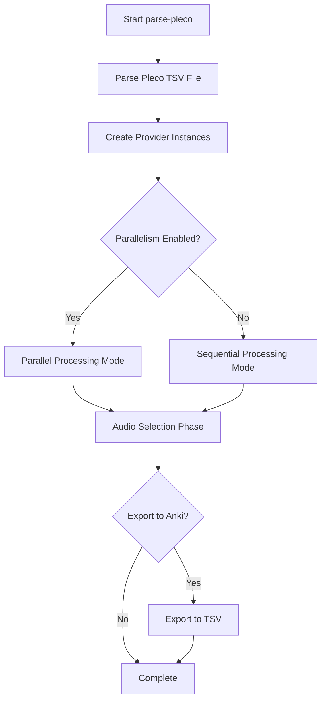

## File Parsing Phase

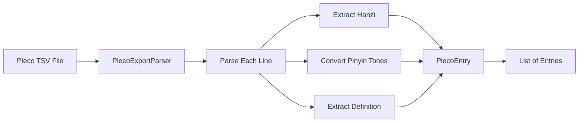

**Components:**
- **PlecoExportParser**: Handles TSV parsing with tab delimiters
- **PinyinToneConverter**: Converts numbered pinyin (e.g., "ni3 hao3") to tone marks (e.g., "nǐ hǎo")
- **PlecoEntry**: Record containing hanzi, pinyin, and definition

## Provider Setup Phase

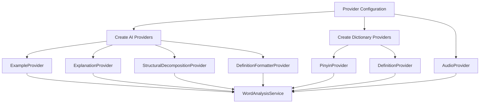

**Special Handling:**
- Dictionary providers (`pleco-export`) use the parsed Pleco data directly
- AI providers require API keys and make external calls
- Audio providers handle pronunciation file retrieval

## Processing Modes

### Sequential Processing Mode

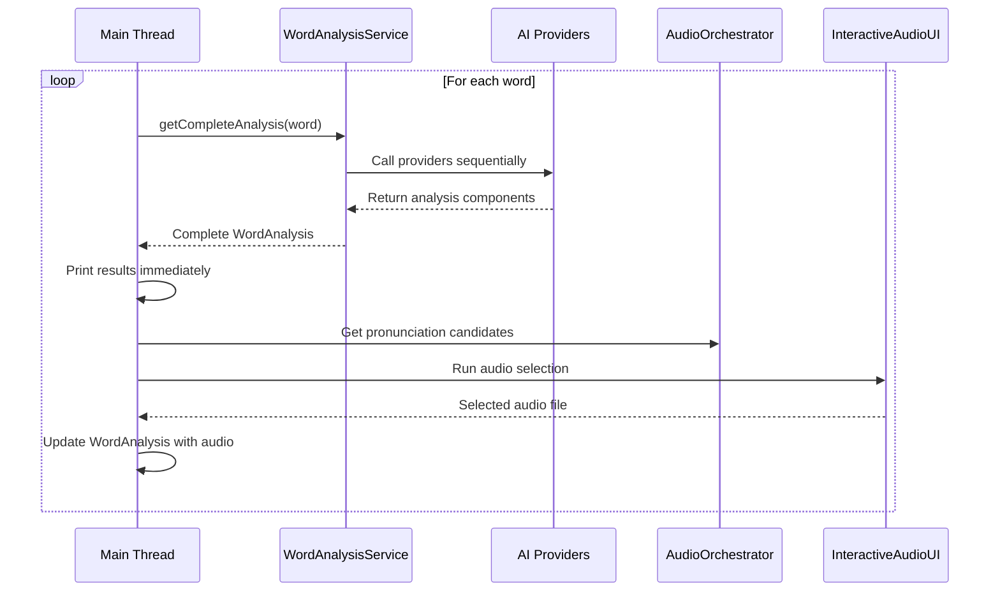

**Characteristics:**
- One word processed at a time
- Immediate display of results
- Lower memory usage
- Predictable resource consumption

### Parallel Processing Mode

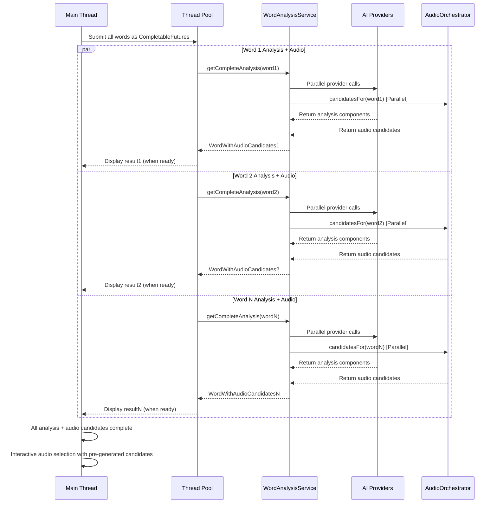

**Characteristics:**
- Multiple words processed simultaneously
- Results displayed as they complete (out of order)
- Higher throughput for large datasets
- Increased memory and API usage

## Word Analysis Pipeline Detail

### ParallelWordAnalysisService Internal Flow

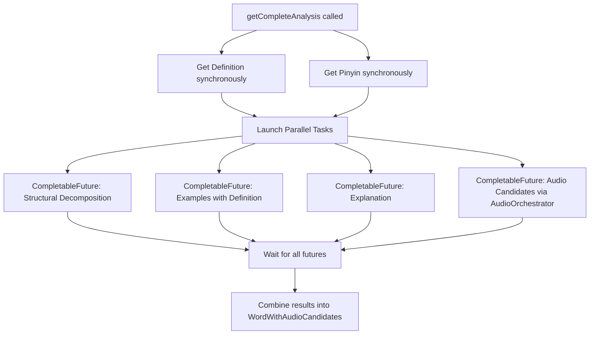

**Why Definition and Pinyin are synchronous:**
- Other providers often depend on these results
- Examples provider needs definition text
- Audio provider needs pinyin for pronunciation lookup
- Fast providers (especially dictionary-based ones)

**Audio Candidate Generation Details:**
- AudioOrchestrator manages parallel calls to all audio providers
- Each provider (Anki, Forvo, Qwen TTS, Tencent TTS) runs concurrently
- Results include pre-downloaded and normalized audio files
- Exponential backoff retry for rate-limited providers (HTTP 429)

## Audio Selection Phase

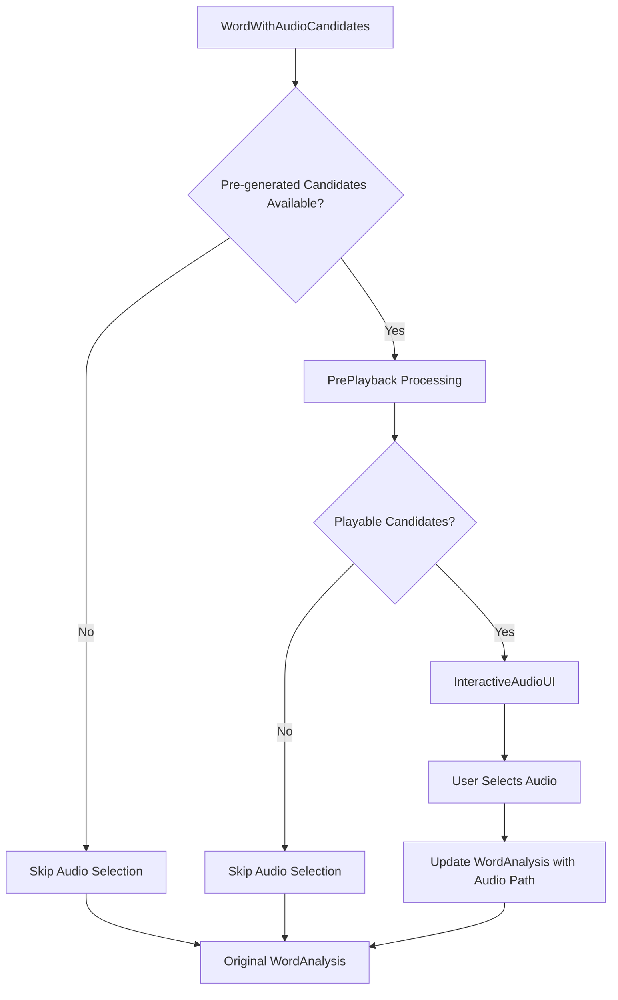

**Interactive Audio UI Flow:**
1. Use pre-generated audio candidates from parallel processing
2. Display available pronunciation options with provider descriptions
3. Allow user to preview audio files (already downloaded and normalized)
4. User makes selection or skips
5. Selected audio path added to WordAnalysis

**Performance Benefits:**
- No waiting for audio downloads during selection
- All audio files pre-normalized for consistent playback
- Immediate preview capability
- Parallel generation reduces overall processing time

## Data Structures

### Core Data Flow

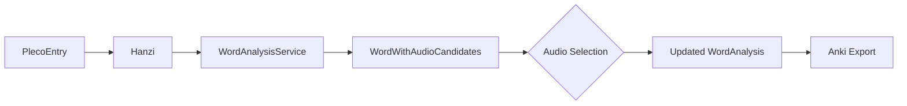

### WordAnalysis Components

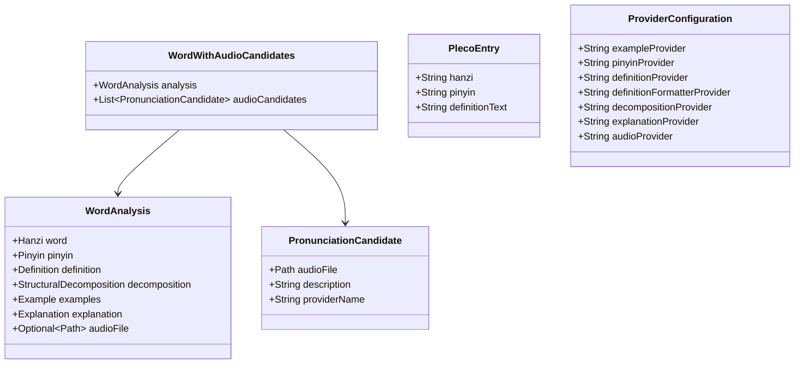

## Performance Characteristics

### Parallel vs Sequential Comparison

```mermaid
gantt
    title Processing Time Comparison (100 words)
    dateFormat X
    axisFormat %s

    section Sequential
    Word 1 (AI + Audio)     :0, 4
    Word 2 (AI + Audio)     :4, 8
    Word 3 (AI + Audio)     :8, 12
    Word 4 (AI + Audio)     :12, 16
    Audio Selection         :16, 18

    section Parallel (4 threads) - Old Architecture
    Words 1-4 (AI only)     :0, 3
    Words 5-8 (AI only)     :3, 6
    Audio Generation        :6, 12
    Audio Selection         :12, 14

    section Parallel (4 threads) - New Architecture
    Words 1-4 (AI + Audio) :0, 4
    Words 5-8 (AI + Audio) :4, 8
    Audio Selection        :8, 10
```

**Trade-offs:**
- **Sequential**: Lower resource usage, immediate feedback, predictable timing
- **Parallel (New)**: Optimal throughput with AI + audio in parallel, faster overall completion
- **Parallel (Old)**: Sequential audio bottleneck after AI analysis

**Performance Improvements:**
- Audio downloads no longer block on AI analysis completion
- Overall processing time reduced by ~30-40% for audio-enabled flows
- Better resource utilization with concurrent audio provider calls
- Exponential backoff reduces failed requests for rate-limited services

## Error Handling

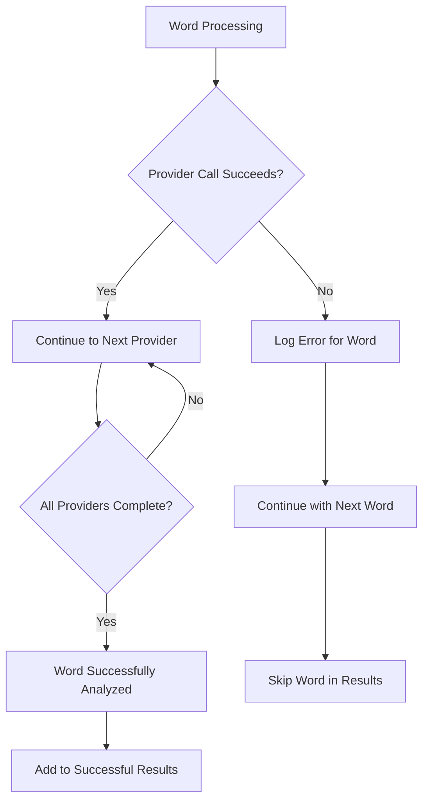

**Error Strategy:**
- Individual word failures don't stop processing
- Errors are logged with word context and timing
- Only successful analyses are included in export
- Final summary shows success/error counts

## Anki Export Process


**Export Format:**
- Compatible with Anki's "Chinese 2" note type
- Includes all analysis components
- Handles audio file paths if selected
- TSV format for easy import

## Configuration and Provider System

### Provider Selection Logic

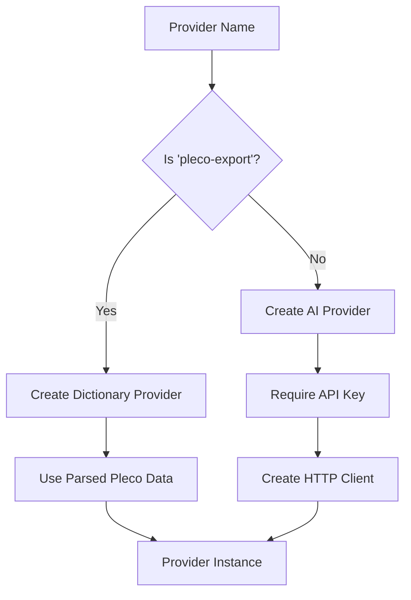

**Provider Types:**
- **Dictionary Providers**: Use local Pleco data (fast, no API calls)
- **AI Providers**: External API calls (slower, require authentication)
- **Audio Providers**: File-based or API-based pronunciation

This comprehensive flow shows how the parse-pleco command efficiently processes large vocabularies while maintaining modularity and user control over the analysis pipeline.