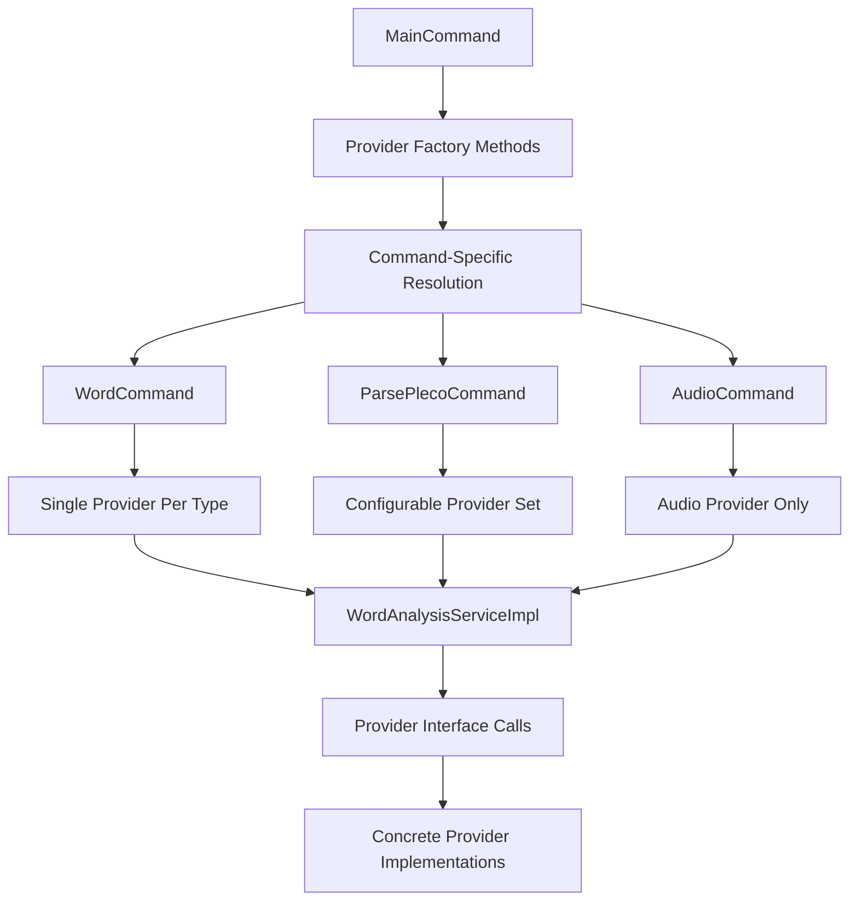

# Provider Architecture Documentation

## Overview

The zh-learn provider system implements a flexible, pluggable architecture for linguistic analysis and pronunciation services. Providers are organized into domain interfaces with multiple implementations, enabling easy switching between local, dictionary-based, and AI-powered services.

## Provider Categories

### Core Provider Types


## Domain Interface Design

### Provider Interface Hierarchy


### Provider Type Classification


## AI Provider System

### AIProviderFactory Architecture


### Configurable Provider Pattern


**Benefits of Configurable Pattern:**
- Consistent error handling across all AI providers
- Standardized prompt template loading
- Unified response parsing and validation
- Centralized caching and logging
- Easy addition of new LLM providers

### Provider Configuration Flow


## Audio Provider Architecture

### Audio Provider Ecosystem


### Audio Processing Pipeline


### Audio Caching Strategy


**Cache Benefits:**
- Eliminates redundant API calls
- Consistent audio quality via normalization
- Faster subsequent lookups
- Reduced bandwidth usage
- Offline availability after first download

## Provider Resolution and Injection

### Dependency Injection Pattern



### Provider Lifecycle Management


## Error Handling and Resilience

### Provider Error Strategy

Qwen TTS continues to follow the fail-fast rule: configuration is validated up front and any non-rate-limit failure immediately propagates as an exception. The only tolerance is for HTTP 429 responses, where we delegate backoff handling to Helidon Fault Tolerance. The Helidon retry policy performs exponential backoff (5s initial, ×3 factor, maximum five attempts within a 15 minute window). If the API still returns 429 after the final attempt, the provider throws an `IOException` and the CLI crashes as required by the constitution.

## Provider Extension Patterns

### Adding New AI Providers

#### Pattern 1: OpenAI-Compatible Provider

```mermaid
flowchart TD
    A[New Provider Requirements] --> B[OpenAI-Compatible API]
    B --> C[Create Provider Config Class]
    C --> D[Add Factory Method Cases]
    D --> E[Environment Variable Setup]
    E --> F[Test Integration]

    C --> G[Define API_KEY_ENV]
    C --> H[Define DEFAULT_BASE_URL]
    C --> I[Implement getApiKey()]
    C --> J[Implement getBaseUrl()]
```

#### Pattern 2: Custom Provider Implementation


### Adding New Audio Providers

```mermaid
flowchart TD
    A[New Audio Provider] --> B[Implement AudioProvider Interface]
    B --> C[Define Provider Metadata]
    C --> D[Implement Core Methods]
    D --> E[Add to MainCommand List]
    E --> F[Test Integration]

    C --> G[getName()]
    C --> H[getDescription()]
    C --> I[getType()]

    D --> J[getPronunciation()]
    D --> K[getPronunciations()]
    D --> L[getPronunciationsWithDescriptions()]
```

## Provider Testing Strategy

### Test Architecture


### Test Implementation Patterns

```java
// Unit Test Pattern
@Test
void shouldReturnExamplesForValidInput() {
    // Arrange
    ExampleProvider provider = new DummyExampleProvider();
    Hanzi word = new Hanzi("学习");
    Definition definition = new Definition("to study");

    // Act
    Example result = provider.getExamples(word, definition);

    // Assert
    assertThat(result).isNotNull();
    assertThat(result.sentences()).isNotEmpty();
}

// Integration Test Pattern
@Test
@EnabledIfEnvironmentVariable(named = "OPENAI_API_KEY", matches = ".+")
void shouldCallRealOpenAIAPI() {
    // Real API integration test
    ExampleProvider provider = AIProviderFactory.createExampleProvider("openai");
    // ... test with real API
}
```

## Configuration and Environment Management

### Environment Variable Patterns


### Configuration Validation


## Performance and Monitoring

### Provider Performance Metrics


### Logging Strategy


**Logging Principles:**
- Never log sensitive data (API keys, user content)
- Include sufficient context for debugging
- Use structured logging for analysis
- Separate performance and error logs
- Provide actionable error messages

This comprehensive provider architecture enables flexible, reliable, and extensible linguistic analysis through a clean separation of concerns and robust error handling patterns.
