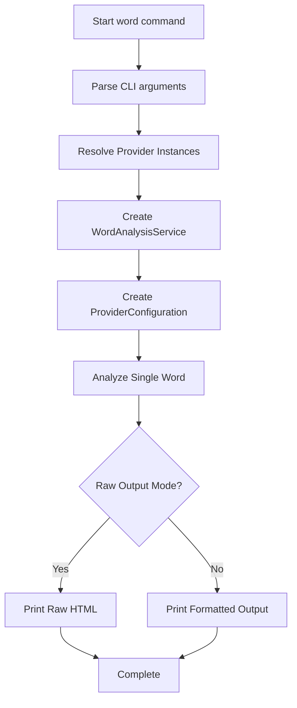
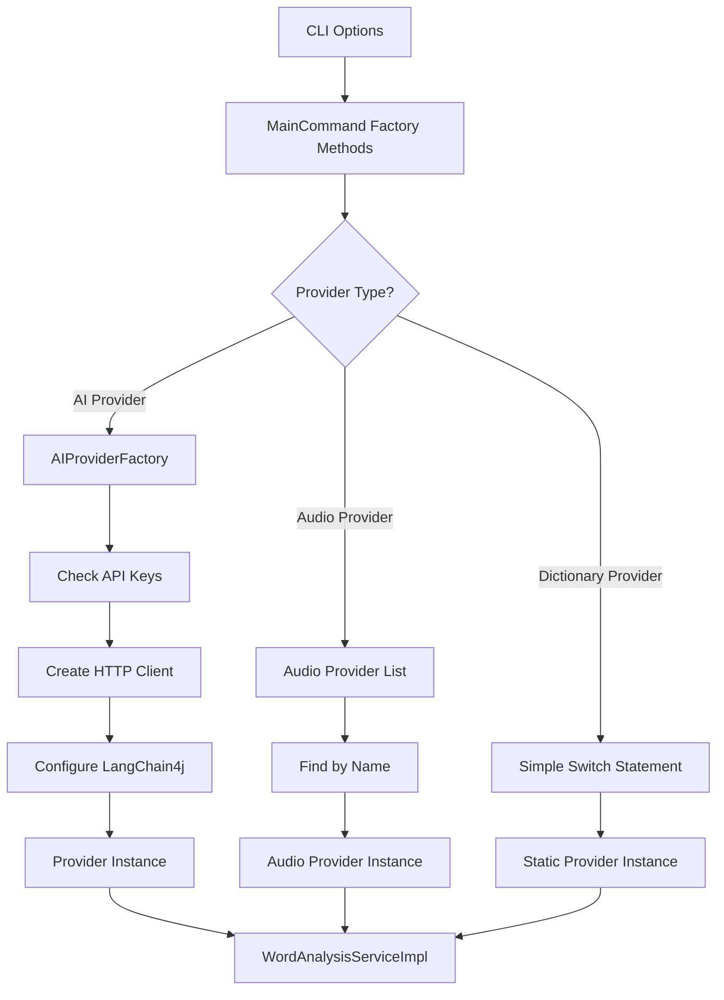
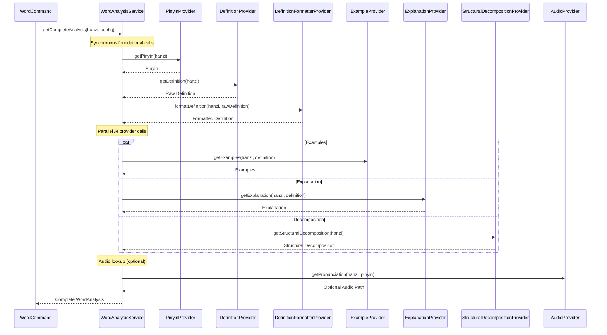
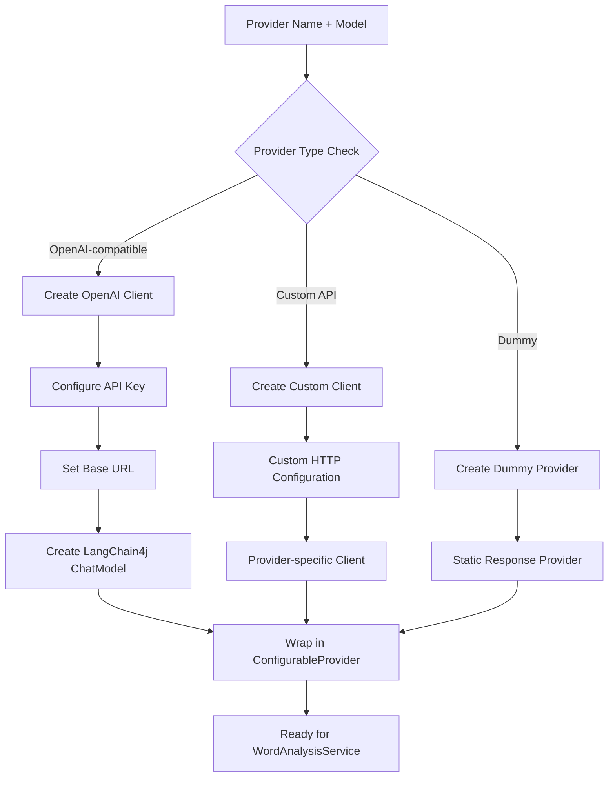
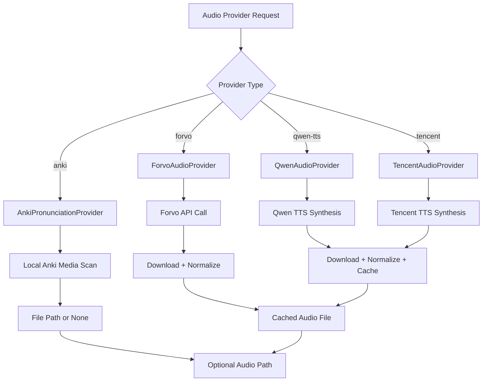
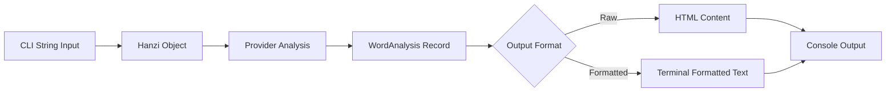
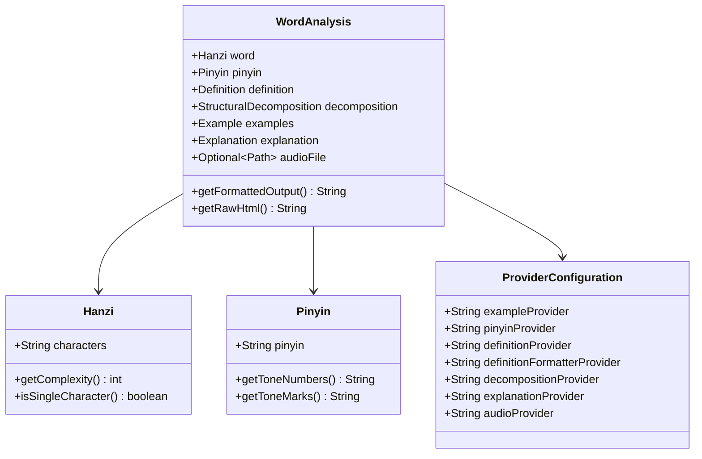
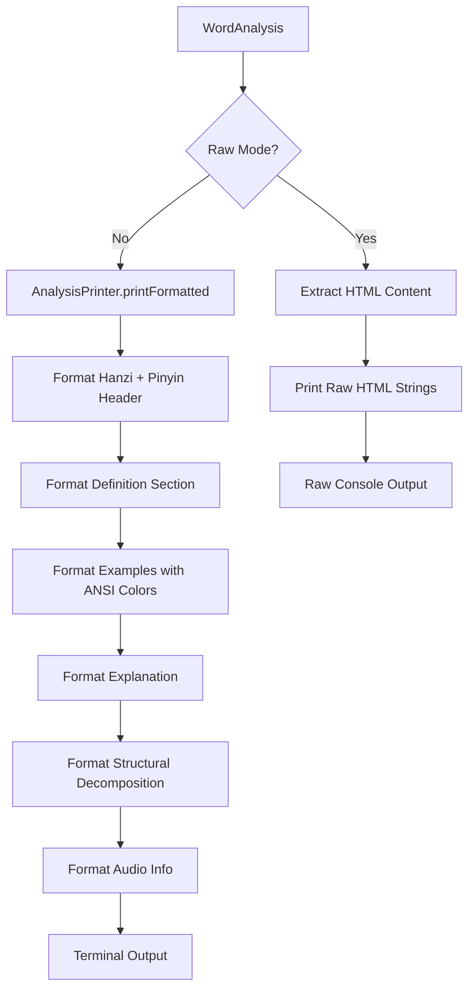
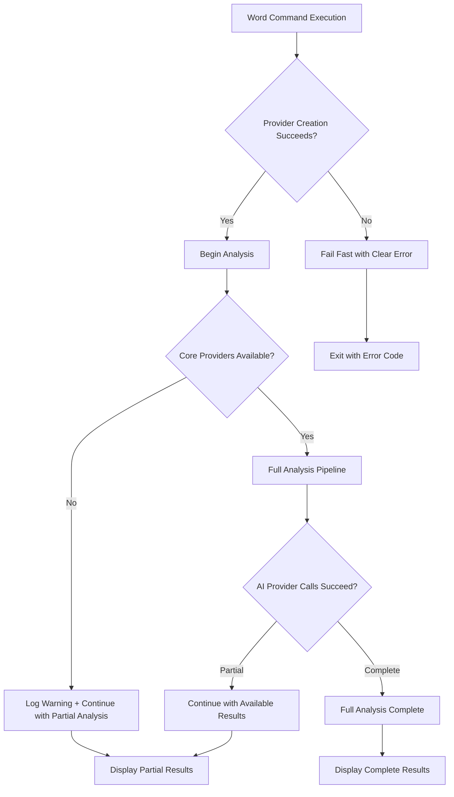

# Word Command Flow Documentation

## Overview

The `word` command performs comprehensive analysis of a single Chinese word using the zh-learn analysis pipeline. It provides AI-powered insights including examples, explanations, structural decomposition, and pronunciation analysis through configurable providers.

## Command Structure

```bash
./zh-learn.sh word <chinese-word> [options]
```

### Key Options
- `--pinyin-provider`: Pinyin generation (default: pinyin4j)
- `--definition-provider`: Definition lookup (default: dummy)
- `--definition-formatter-provider`: Definition formatting via AI (default: dummy)
- `--decomposition-provider`: Structural decomposition analysis (default: dummy)
- `--example-provider`: Usage examples generation (default: dummy)
- `--explanation-provider`: Linguistic explanations (default: dummy)
- `--audio-provider`: Pronunciation audio (default: anki)
- `--model`: Specific AI model for providers (e.g., gpt-4, claude-3-sonnet)
- `--raw`: Display raw HTML content instead of formatted output

## Processing Flow

### High-Level Command Flow



## Provider Resolution Phase



**Provider Categories:**
- **AI Providers**: Require API keys, use LangChain4j (examples, explanations, decomposition, definition formatting)
- **Audio Providers**: File-based or API-based pronunciation (anki, forvo, qwen-tts, tencent)
- **Dictionary Providers**: Local lookups (pinyin4j, dummy)

## Single Word Analysis Pipeline

### WordAnalysisService Flow



**Processing Order:**
1. **Synchronous Phase**: Pinyin and definition (needed by other providers)
2. **Parallel Phase**: AI providers that can run concurrently
3. **Audio Phase**: Pronunciation lookup using generated pinyin

## Provider System Detail

### AI Provider Creation Flow



**Supported AI Providers:**
- **OpenAI**: gpt-4, gpt-3.5-turbo
- **DeepSeek**: deepseek-chat, deepseek-coder
- **Qwen**: qwen-max, qwen-plus, qwen-turbo
- **Zhipu**: glm-4-flash, glm-4.5
- **OpenRouter**: Multiple models (claude, llama, etc.)
- **Gemini**: gemini-pro, gemini-1.5-pro

### Audio Provider Architecture



**Audio Provider Characteristics:**
- **Anki**: Fastest (local file scan), no API required
- **Forvo**: Community pronunciation database, requires API key
- **Qwen TTS**: AI-generated Chinese speech, requires DASHSCOPE_API_KEY
- **Tencent**: Professional TTS service, requires Tencent Cloud credentials

## Data Processing Flow

### Core Data Transformations



### WordAnalysis Components



## Output Formatting

### Terminal Output Pipeline



**Formatting Features:**
- **ANSI Colors**: Syntax highlighting for different content types
- **Unicode Support**: Proper rendering of Chinese characters and tone marks
- **Responsive Layout**: Adapts to terminal width
- **HTML Fallback**: Raw mode preserves original formatting

## Error Handling Strategy



**Error Philosophy:**
- **Fail Fast**: Invalid configurations terminate immediately
- **Graceful Degradation**: Missing AI providers result in partial analysis
- **User Feedback**: Clear error messages with actionable guidance
- **No Silent Failures**: All errors logged or displayed to user

## Performance Characteristics

### Single Word vs Batch Processing

```mermaid
gantt
    title Single Word Analysis Timing
    dateFormat X
    axisFormat %s

    section Word Command
    Pinyin + Definition    :0, 1
    Parallel AI Calls     :1, 4
    Audio Lookup          :4, 5
    Formatting + Display  :5, 6

    section Parse-Pleco (per word)
    Pinyin + Definition    :0, 1
    Parallel AI + Audio   :1, 4
    Display Results       :4, 5
```



**Optimization Notes:**
- Single word analysis optimized for immediate feedback
- AI providers called in parallel to minimize latency
- Audio lookup happens after AI analysis (not blocking)
- Terminal formatting is lightweight and fast

## Configuration Examples

### Basic Usage
```bash
# Minimal analysis with default providers
./zh-learn.sh word 学习

# AI-powered analysis with specific providers
./zh-learn.sh word 学习 \
  --example-provider deepseek-chat \
  --explanation-provider qwen-max \
  --decomposition-provider glm-4-flash
```

### Advanced Configuration
```bash
# Full AI analysis with custom model
./zh-learn.sh word 学习 \
  --example-provider openrouter \
  --model claude-3-sonnet \
  --explanation-provider openrouter \
  --model gpt-4 \
  --audio-provider qwen-tts \
  --raw
```

### Provider Dependencies
- **API Keys Required**: OPENAI_API_KEY, DEEPSEEK_API_KEY, DASHSCOPE_API_KEY, etc.
- **Environment Setup**: Provider-specific configuration via environment variables
- **Fallback Strategy**: Dummy providers for testing without API access

This comprehensive flow demonstrates how the word command provides immediate, detailed analysis of Chinese vocabulary through a flexible provider system optimized for both speed and extensibility.
